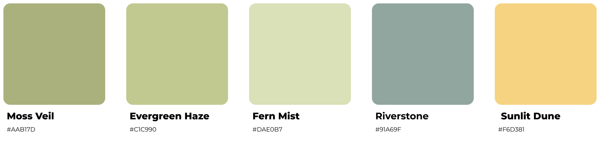
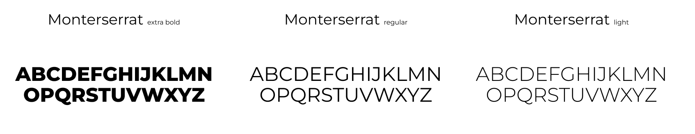

# [EcoDraw](https://www.ecodraw.io)

This project is a web application designed to help users design and manage energy systems by populating a canvas with various devices (like transformers and energy storage units). The app includes a map integration for geographic context, a backend powered by Node.js and Express.js, and a frontend built with React.

## Table of Contents

- [EcoDraw](#ecodraw)
  - [Table of Contents](#table-of-contents)
  - [Features](#features)
  - [Technologies](#technologies)
  - [Project Structure](#project-structure)
  - [Installation](#installation)
    - [Prerequisites](#prerequisites)
    - [Clone the Repository](#clone-the-repository)
  - [Install Dependencies](#install-dependencies)
  - [Environment Variables](#environment-variables)
    - [Frontend (frontend/.env)](#frontend-frontendenv)
    - [Backend (backend/.env)](#backend-backendenv)
  - [Running the Application](#running-the-application)
    - [Development](#development)
      - [Backend](#backend)
      - [Frontend](#frontend)
  - [Deployment](#deployment)
    - [Docker](#docker)
    - [Build and run the containers:](#build-and-run-the-containers)
  - [API Documentation](#api-documentation)
    - [GET /api/sites](#get-apisites)
    - [POST /api/sites:uuid](#post-apisitesuuid)
    - [PUT /api/sites/:uuid](#put-apisitesuuid)
    - [GET /api/devices](#get-apidevices)
  - [UX/UI](#uxui)
    - [Vision and Branding](#vision-and-branding)
    - [Users](#users)
    - [Pages](#pages)

## Features

- **Interactive Design Canvas:** Add devices to a canvas to design energy systems. Zoom and pan around at your leisure.
- **Dynamic Layout Management:** Automatically manage and optimize device layouts to ensure no overlaps and proper adherence to device offset guidelines.
- **API Integration:** Fetch and update data from a backend API built with Node.js and Express.js.
- **Google Maps Integration:** Display geographic site data on a map using the `@react-google-maps/api` library.
- **Responsive UI:** Built with Tailwind CSS and Material UI for a modern and responsive user experience.

## Technologies

- **Frontend:** React, Tailwind CSS, Material UI, @react-google-maps/api
- **Backend:** Node.js, Express.js, Supabase
- **Database:** Supabase (PostgreSQL)
- **Deployment:** Docker, Hostinger VPS

## Project Structure
``` sh
.
├── backend
│   ├── server.ts
│   ├── routes
│   │   └── sites.ts
│   └── controllers
│       ├── deviceController.ts
│       └── sitesController.ts
├── frontend
│   ├── src
│   │   ├── assets
│   │   ├── components
│   │   ├── pages
│   │   ├── services
│   │   └── App.tss
│   ├── public
│   └── package.json
├── docker-compose.yml
└── README.md
```

## Installation

### Prerequisites
- Node.js (>=18.x)
- Docker (for deployment)
- Supabase account

### Clone the Repository
``` sh
git clone https://github.com/g-blok/ecodraw.git
cd ecodraw
```


## Install Dependencies
Navigate to both the frontend and backend directories and install dependencies:
``` sh
# For frontend
cd frontend
npm i

# For backend
cd ../backend
npm i
```

## Environment Variables
Create a `.env` file in both frontend and backend directories and include the following:
### Frontend (frontend/.env)
``` sh
VITE_GOOGLE_MAPS_API_KEY=your-google-maps-api-key
```

### Backend (backend/.env)
``` sh
PORT=5000
CORS_ORIGIN=http://localhost:8000  # frontend app port
SUPABASE_URL=https://your-supabase-url.supabase.co
SUPABASE_KEY=your-supabase-key
```

## Running the Application
### Development
#### Backend
```
cd backend
npm run dev
```
#### Frontend

``` sh
cd frontend
npm run start
```

The frontend will be available at http://localhost:8000 and the backend at http://localhost:5000/api.

## Deployment
### Docker
To containerize and deploy your app, follow these steps:

- Ensure Docker is installed and running on your machine.
- Update your domain's DNS settings in your domain manager (I use Porkbun) to point to your host server's IP address (I use Hostinger VPS).

### Build and run the containers:

``` sh
docker compose up --build -d
```

Access your app via the domain you’ve configured in your domain manger.
  

## API Documentation
### GET /api/sites
Fetches a list of all sites stored in the Supabase database.
### POST /api/sites:uuid
Creates a new site with the provided data.
**Request Body:** 
```json5
{
	"name": "string", // The name of the site
	 "id": "string", // A unique identifier for the site
	 "path": "string", // The URL path for the site
	 "address": "string", // The physical address of the site
	 "lat": "number", // The latitude of the site's location
	 "long": "number", // The longitude of the site's location
	 "stage": "string", // The current stage of the site (e.g.,"design", "operational")
	 "market": "string", // The market the site is part of (e.g., "CAISO", "ERCOT")
	 "metering": "string", // The metering type used at the site
	 "revenue_streams": ["string"],// (Optional) An array of revenue streams associated with the site (e.g., "SGIP", "DRAM")
	 "layout": [ // (Optional) A 2D array of devices representing the site layout 
      [
        {
          "name": "string", // The name of the device
          "mfg": "string", // The manufacturer of the device
          "category": "storage", // The category of the device (e.g., "storage", "transformer")
          "length": "number", // The length of the device
          "width": "number", // The width of the device
          "cost": "number", // The cost of the device
          "release_date": "number|null",// The release date of the device (timestamp), or null if not released
          "capacity_kwh": "number", // The capacity of the device in kWh
          "color": "string", // The color associated with the device
          "x": "number", // (Optional) The x-coordinate of the device on the layout
          "y": "number", // (Optional) The y-coordinate of the device on the layout
          "uuid": "string", // (Optional) A unique identifier for the device
          "img": "string" // (Optional) An image URL for the device
        }
      ]
	  ]
 }
```
### PUT /api/sites/:uuid
Updates the site layout or other information for the site with the specified UUID. Pass any one or several parameters to the endpoint to update.
**Request Body**
``` json5
{
	"name": "string",
	"layout": Device[][]
}
```
### GET /api/devices
Fetches a list of all system device definitions.

## UX/UI

### Vision and Branding

The vision for this tool is to create a light, welcoming, and professional environment that evokes a new perspective on being green. The branding centers around muted earth tones like moss and riverstone, with a color palette and font choices that offer a solarpunk vibe. The aesthetic is designed to be secure enough to manage business operations while remaining approachable and engaging enough for users to spend hours in. This balance of professionalism and playfulness is intended to make the tool both functional and enjoyable to use.





### Users

This tool is designed to support energy storage and renewable energy developers throughout the entire lifecycle of their projects, from sales to operations. The main users include:

- **Electrical Engineers, Sales Engineers, Analysts:**
  - Design site layouts.
  - View projected revenue and costs.
  - Create detailed reports.
  
- **Sales Teams:**
  - Manage projects through the selling process.
  - Oversee the progress of sold projects.
  
- **Operations Teams:**
  - Oversee the ongoing maintenance of sold projects.
  
- **C-Suite:**
  - Oversee dashboards for sales and operations, ensuring high-level visibility of all projects.

### Pages

The application consists of four main pages:

1. **Home:** The landing page providing an overview and navigation to other sections.
2. **Site -> Table:** A page where users can view a table of sites and related details.
3. **Site -> Design:** The interactive page for designing site layouts and configuring devices.
4. **Management:** A page for managing projects and monitoring their progress through various stages.

**Thanks for stopping by** 🌱
